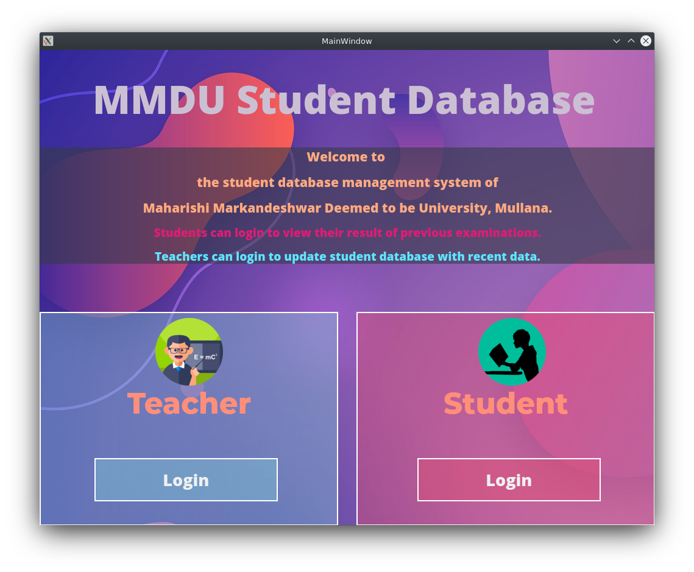
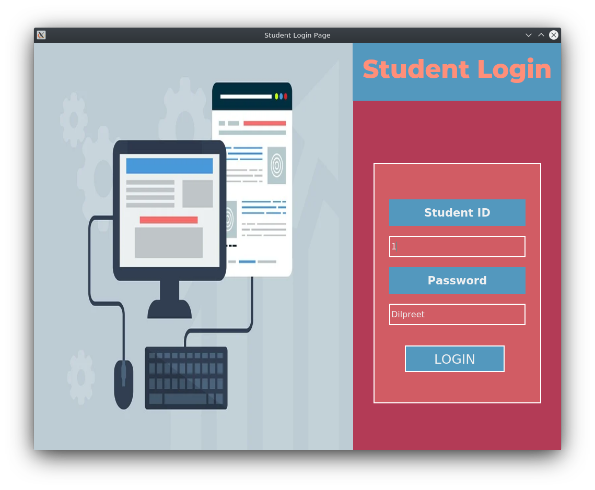
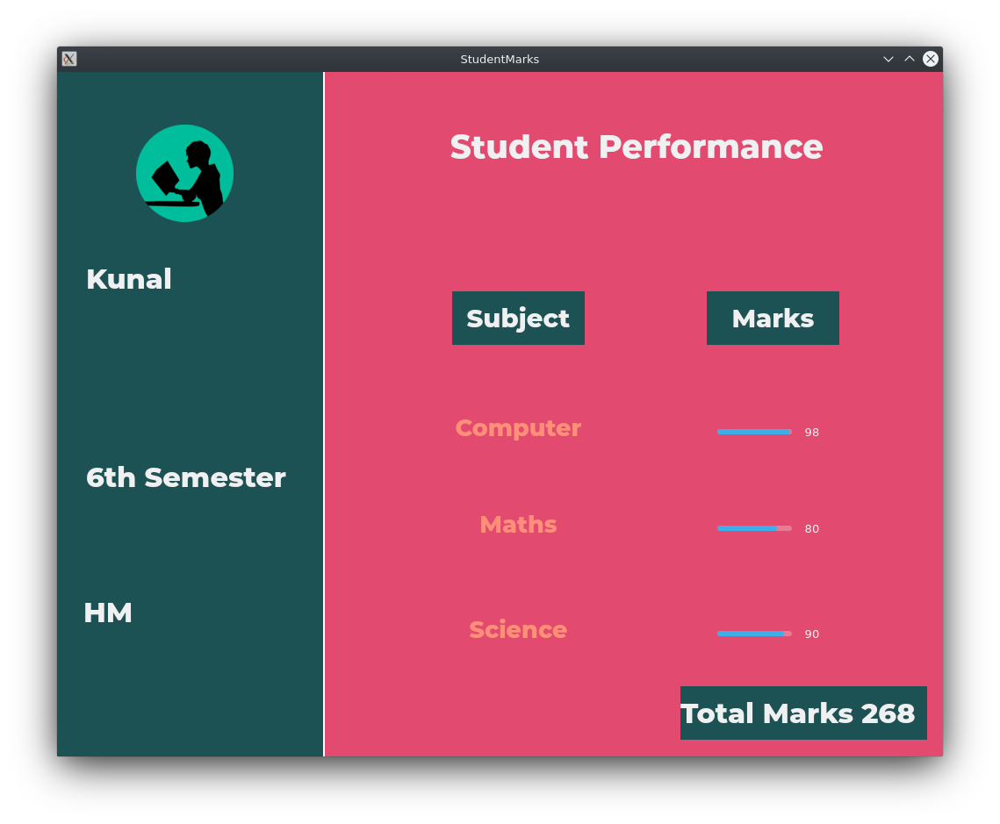
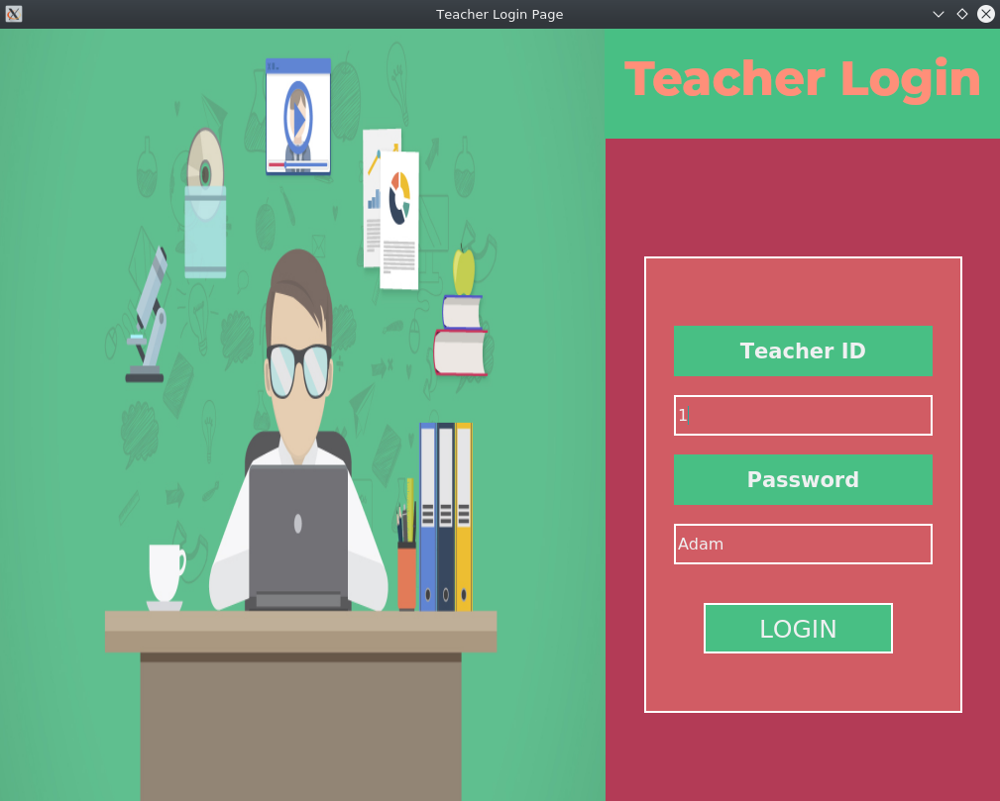
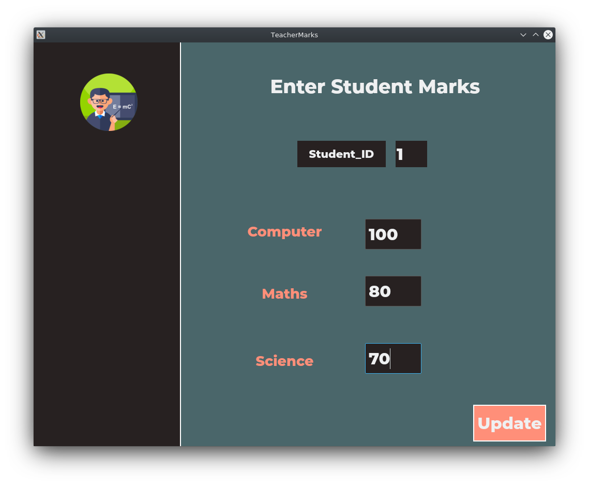

# StudentDatabase

This Repository is my 3 days Corona Virus Self Quarantine Challange to create a Student Marks Database Management System graphical User Interface using PyQt5 and SQLite3.

### There are 2 kind of login system.

1. Student who can login and view there performance in exams.

2. Teachers who can update the student performance in recent exams.

### Home Screen of GUI

### Student Login Page

### Student Marks Details Page

### Teacher Login Page

### Teacher Marks Update Page

